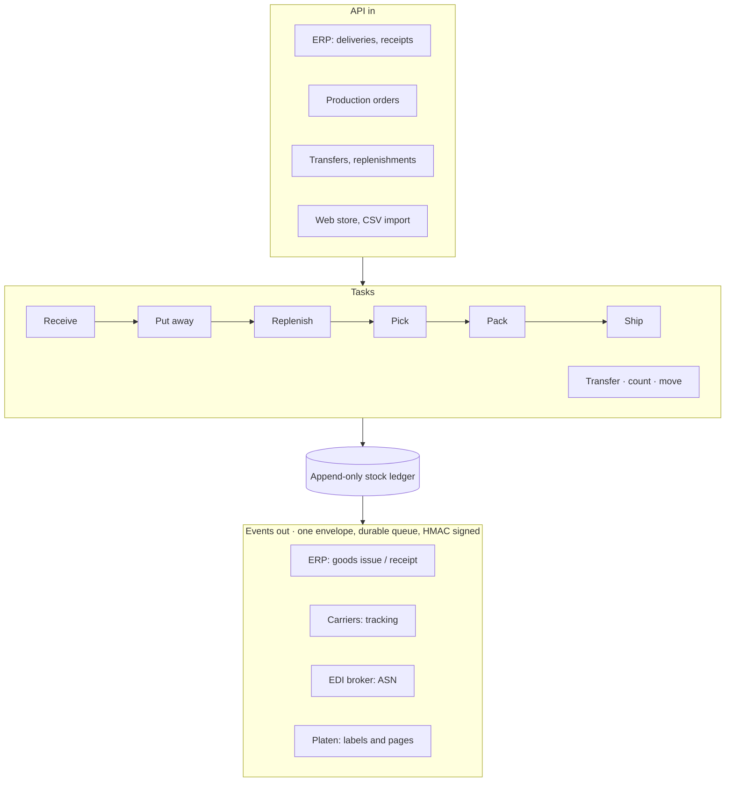
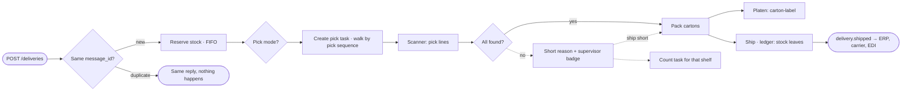
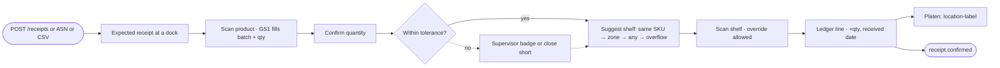
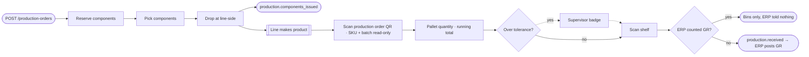
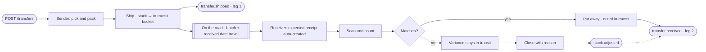
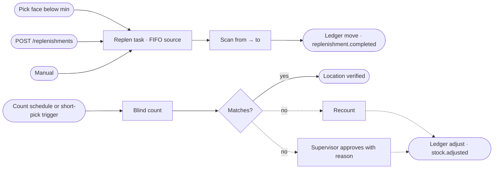
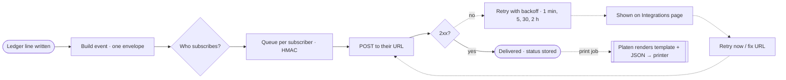

# Simple WMS — process flows

Every task ends in a ledger line. Every ledger line can become an event.
Gold (dashed) paths in the diagrams are exceptions.

## Overview

## Flow 1 — Outbound delivery

## Flow 2 — Inbound receipt and putaway

## Flow 3 — Production

## Flow 4 — Cross-warehouse transfer

## Flow 5 — Replenishment and cycle count

## Flow 6 — Events and print jobs (the durable queue)

The full swimlane versions (ERP/API, WMS engine, Scanner, outside systems)
are in `design/flows/` and on the "Process flows" page of the Simple WMS UI
design file.
